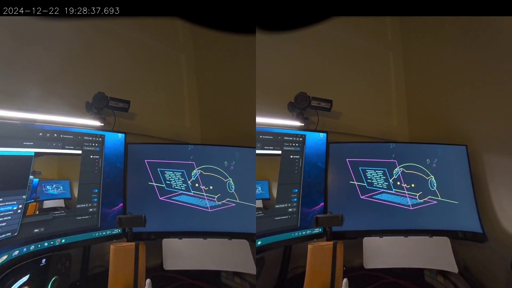

### Scrcpy (Quest 3 Timestamped Casting Fork)

[Original Scrcpy README](Original_README.md)

> **Warning**: This fork is intended for research purposes only. For standard Quest 3 casting, please use Meta's official tools.

This modified version of Scrcpy enables capturing synchronized stereo video feeds from the Quest 3, including precise device timestamps. This makes it possible to correlate the video frames with other sensor data like head position and rotation - particularly useful for computer vision research and 3D reconstruction experiments.

#### New Command Line Options

`--opencv`
- Enables OpenCV processing to eliminate fisheye distortion from the Quest 3 cameras

`--opencv-map "stereo_rectification_maps.xml"` 
- Path to the OpenCV remap calibration data file (see format documentation)
- The calibration file should be an OpenCV XML file containing 4 mapping matrices:
    - `leftMapX`: X-axis mapping for left camera undistortion
    - `leftMapY`: Y-axis mapping for left camera undistortion  
    - `rightMapX`: X-axis mapping for right camera undistortion
    - `rightMapY`: Y-axis mapping for right camera undistortion
    Each map should be a single-channel floating point (CV_32F) matrix matching the camera resolution.
- Redo the calibration on your Quest 3 if possible. The provided calibration file ([stereo_rectification_maps.xml](assets/stereo_rectification_maps.xml)) is optimized for 1920x1024 video resolution (use `-max-size 1920` when capturing)

`--adb-path=".\adb.exe"`
- Specify ADB executable location if not in system PATH
- Required only for timestamp-related features (show-timestamps, save-frames, pipe-output)
- When using these features, specify the target device with `--serial <device-id>`. You can list all connected devices and their IDs using `adb devices -l`

`--show-timestamps`
- Display current frame timestamps (in milliseconds) from the Quest 3 device at the top of the window

`--save-frames`
- Save captured frames as PPM image files to specified directory, with filenames in the format "frame_<frame_number>_<timestamp>.ppm" where timestamp is in milliseconds since epoch

`--frame-dir=".\image_save_folder"`
- Target directory for saving captured frame images

`--pipe-output`
- Stream frame data with timestamps to stdout
- Can be piped to other programs (e.g., `--pipe-output | another-program.exe`) 
- Also supports Windows named pipes
- Binary format for each frame:
  - Frame Header (32 bytes):
    - 8-byte delimiter: 0xFF repeated 8 times
    - 8-byte timestamp in milliseconds since epoch
    - 4-byte frame width
    - 4-byte frame height  
    - 4-byte frame size in bytes
    - 4-byte header checksum
  - Frame Data:
    - YUV420P format
    - Y plane: width * height bytes
    - U plane: (width * height) / 4 bytes
    - V plane: (width * height) / 4 bytes

Example usage:
`scrcpy --serial=XXX --no-audio --no-control --max-fps 30 --max-size 1920 --opencv --opencv-map "stereo_rectification_maps.xml" --adb-path="adb.exe" --show-timestamps` (This command reproduces the setup shown in the teaser image)